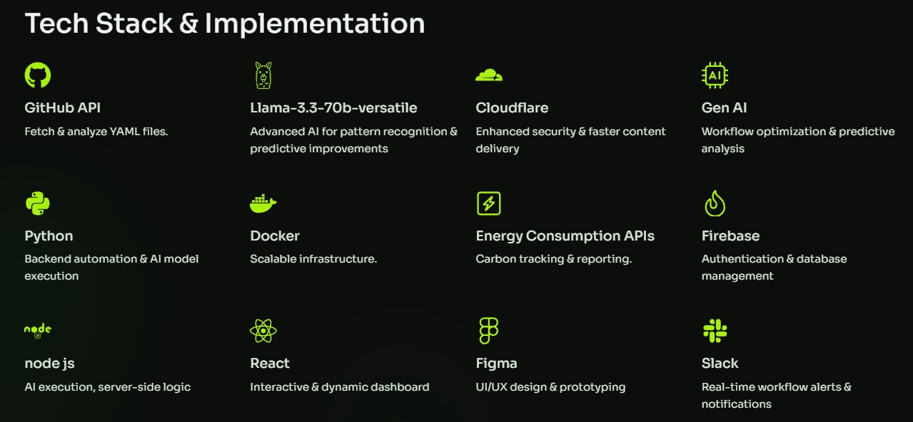

# 

# 🚀 GitHub Workflow Optimizer

**AI-Powered Optimization for Faster, Greener, and Smarter CI/CD Pipelines**

---

## 🔹 Overview

Inefficient CI/CD workflows lead to **high cloud costs, increased carbon emissions, and slow deployments**. Our **AI-driven GitHub Workflow Optimizer** automatically detects inefficiencies, reduces CPU/GPU usage, and **optimizes resource consumption—saving time, money, and the environment**.

---

## 🌟 Features

✅ **Automated GitHub Workflow Analysis** – Detects bottlenecks in build processes.

✅ **CPU/GPU & Carbon Emission Reduction** – Optimizes compute usage, reducing cloud costs.

✅ **Real-Time AI-Driven Fixes** – Applies smart optimizations instead of just reporting inefficiencies.

✅ **Seamless Integration** – Works directly with GitHub repositories, requiring minimal setup.

---

**Explore the idea** - https://gamma.app/docs/Smarter-Faster-Greener-The-Future-of-CICD-Optimization-mprzgfip3gq0ta9

## 🛠 How It Works

1️⃣ **Paste your GitHub repository URL** or connect your account.

2️⃣ **Our AI analyzes your workflows** and detects inefficiencies.

3️⃣ **Suggested optimizations** appear in the dashboard.

4️⃣ **Apply AI-powered fixes** with a single click.

---

## 📊 Before vs. After Optimization

| Metric | Before Optimization | After Optimization |
| --- | --- | --- |
| Build Time | **15 mins** | **7 mins** |
| CPU Usage (%) | **85%** | **50%** |
| CO₂ Emissions | **64 metric tons** | **36 metric tons** |

🔍 **See how your workflows improve instantly!**

---

## 🚀 Get Started

1. Navigate to **Dashboard**
2. Paste your **GitHub repository link**
3. **Run analysis** to detect inefficiencies
4. **Apply AI-powered fixes**

---

## 💡 Why Use This?

🔹 **Saves up to 40% on cloud costs**

🔹 **Cuts down deployment time by 50%**

🔹 **Eco-friendly – reduces carbon footprint**

🔹 **No manual DevOps needed**

---

## 🛠 Tech Stack

---

## 📜 License

This project is licensed under the [MIT License](LICENSE).

---

## 💬 Need Help?

For any queries, reach out.

🚀 **Optimize your CI/CD workflows today!**
